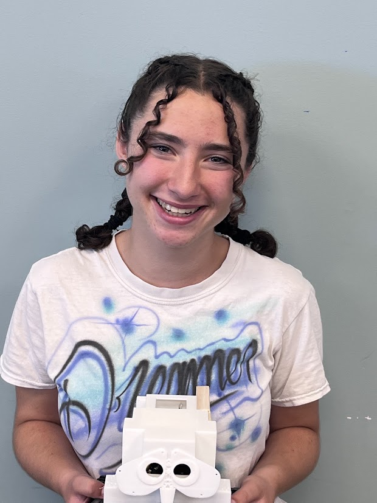

# Mini Tank: Wilma the WOAHbot
My project is a Mini Tank Robot. Essentially the robot uses a bluetooth to read signals sent from the app and then uses the switch() method in C++ to choose what to do. According to different cases the robot will move in different directions and project the corresponding arrow on the LED board. The hardest part about the build was understanding how the wires connected and operated relative to the board. The arduino runs on digital pins, and I've been using PWM in order to simulate what analog pins would be able to do, namely allowing the robot to move at different speeds. I also editted the code for the robot so that other buttons would allow the robot to turn while moving rather than either going straight or rotating on its own axis. One of the hardest things to build in this project was the CAD for the outside because the arms included a ball-and-socket mechanism and took countless tries to figure out how to fit the ball in the socket without falling out of it. Also, I don't understand C++ so in the beginning it was a bit challenging to code. After taking copious color-coded notes however, I was able to understand what the different functions do relative to the robot. Overall, during this project I learned about various systems and methods like PWM, IIC, and Bluetooth which all allowed me to gain a deeper understanding of how my robot, and other electronics, works.

<!--You should comment out all portions of your portfolio that you have not completed yet, as well as any instructions: -->

| **Engineer** | **School** | **Area of Interest** | **Grade** |
|:--:|:--:|:--:|:--:|
| Vivian F. | Los Gatos High School | Electrical Engineering | Incoming Senior



# First Milestone

<iframe width="560" height="315" src="https://www.youtube.com/embed/w1hHq3U6-G4?si=9fnR-Sp6K69DlYNv" title="YouTube video player" frameborder="0" allow="accelerometer; autoplay; clipboard-write; encrypted-media; gyroscope; picture-in-picture; web-share" referrerpolicy="strict-origin-when-cross-origin" allowfullscreen></iframe>

## Components
The components within my robot are the motor system, the ultrasonic sensor that rotates on a swivel, the robot's framework, and the arduino board. For my first milestone I started by building out the motor system which involved several plates that I screwed with the motors themselves, the wheels, and the wheel belts. Afterwards I built the robot's framework, which included the base plate, the LED display, and all the sensors except for the ultrasonic sensor. Next I built the ultrasonic sensor mechanism, or the face of the robot, which involves an ultrasonic sensor attached to a swivel. Finally, I assembled the arduino board itself and connected all the parts together.

## Challenges
One of the challenges I faced when building the robot was just trying to create the wheel mechanism. I made a substituion for a longer screw in the place of a shorter one and later on was unable to use the shorter screw in the longer screw's place. I had to dissassemble the entire structure to redo it. From that I learned that it's best to stick to the right parts as listed in the instructions, and to not just assume I have the resources to use any piece in another's stead. Another issue I had was just with assembling the robot's structure because apparently for a cleaner finish it is best to remove the paper layer on the base plate. Because of that I had to dissassemble and reassemble the entire robot which was very painful. Also, because the breadboards didn't fully combine together I assumed that something was wrong with them but apparently that was just how it fit together.

## Future Plan
In the future I want to add a CAD exterior, and if time permits then the CAD exterior arm would have a ball and socket. Also, I want to paint the exterior of my CAD to make it look more unique, rather than the boring white plastic of the CAD. I also want to work on editing the code so that my robot can move in more complex ways rather than only being able to rotate or turn. I want to enable my robot to turn and move at the same time.

<!-- For your first milestone, describe what your project is and how you plan to build it. You can include: -->
<!-- - An explanation about the different components of your project and how they will all integrate together -->
<!-- - Technical progress you've made so far -->
<!-- - Challenges you're facing and solving in your future milestones -->
<!-- - What your plan is to complete your project -->

# Second Milestone

<iframe width="560" height="315" src="https://www.youtube.com/embed/JIrFPbK689g?si=9VcRaQSX-hb6To9b" title="YouTube video player" frameborder="0" allow="accelerometer; autoplay; clipboard-write; encrypted-media; gyroscope; picture-in-picture; web-share" referrerpolicy="strict-origin-when-cross-origin" allowfullscreen></iframe>

## Accomplishments
This milestone mainly consisted of uploading and understanding the code for the robot. The code did come prewritten but I decided that I wanted to understand the code and decipher it anyways, especially since I was interested in making modifications. I have had previous experience with java in school, but none with C++ so deciphering the code was definitely a journey. What I ended up doing was writing down all my code on a piece of paper and then writing all my notes and questions surrounding the code. It took me about a week but I now feel like I have basic understanding of how the code works.
## Challenges to Overcome
Ridiculously one of the biggest challenges to overcome was when something broke in the robot and we couldn't figure out what. We tried switching the battery and plugging in all the wires all over again. We could not figure out what was wrong with the robot. Turns out one of the instructors had turned my robot off, and we had spent 30 minutes trying to figure out what was broken. So needless to say I learned the importance of keeping track of the state of your robot and what has been done to it. Also, it is important to turn off your robot so you don't kill the battery and the instructors have to turn it off for you. One of the other challenges faced was trying to find the right libraries to use because the code was not the most updated code relative to arduino libraries. So I actually had to go a couple years ago to find the right libraries to use, it was a lot of troubleshooting.
## Next Milestone
For my next milestone I am going to work on the exterior of the robot. Mostly this will consist on working on the CAD and making the robot have a cool exoskeleton that hides all the internal workings and wires. Also, at some point I want to work on integrating the ultrasound and its use into the code so that hopefully there is an override function that prevents me from repeatedly driving the robot into the wall or into chairs. I also want to add two more switch cases that allow my robot to turn without rotating on its own axis because as of now that is what it does. The motion does not mimic that of a car's at all and I want it to resemble a car more.

<!-- For your second milestone, explain what you've worked on since your previous milestone. You can highlight: --> 
<!-- - Technical details of what you've accomplished and how they contribute to the final goal -->
<!-- - What has been surprising about the project so far -->
<!-- - Previous challenges you faced that you overcame -->
<!-- - What needs to be completed before your final milestone  -->

# Final Milestone

<iframe width="560" height="315" src="https://www.youtube.com/embed/OLPH3qbCWWQ?si=1EEm7qw2A0E9uIOH" title="YouTube video player" frameborder="0" allow="accelerometer; autoplay; clipboard-write; encrypted-media; gyroscope; picture-in-picture; web-share" referrerpolicy="strict-origin-when-cross-origin" allowfullscreen></iframe>

For your final milestone, explain the outcome of your project. Key details to include are:
- What you've accomplished since your previous milestone
- What your biggest challenges and triumphs were at BSE
- A summary of key topics you learned about
- What you hope to learn in the future after everything you've learned at BSE

# Schematics 
Here's where you'll put images of your schematics. [Tinkercad](https://www.tinkercad.com/blog/official-guide-to-tinkercad-circuits) and [Fritzing](https://fritzing.org/learning/) are both great resoruces to create professional schematic diagrams, though BSE recommends Tinkercad becuase it can be done easily and for free in the browser. 

# Code

```c++
/*
 keyestudio Robot Car v2.0
 lesson 14.2
 bluetooth car
 http://www.keyestudio.com
*/

//Array, used to store the data of pattern
unsigned char start01[] = {0x01,0x02,0x04,0x08,0x10,0x20,0x40,0x80,0x80,0x40,0x20,0x10,0x08,0x04,0x02,0x01};
unsigned char front[] = {0x00,0x00,0x00,0x00,0x00,0x24,0x12,0x09,0x12,0x24,0x00,0x00,0x00,0x00,0x00,0x00};
unsigned char back[] = {0x00,0x00,0x00,0x00,0x00,0x24,0x48,0x90,0x48,0x24,0x00,0x00,0x00,0x00,0x00,0x00};
unsigned char left[] = {0x00,0x00,0x00,0x00,0x00,0x00,0x44,0x28,0x10,0x44,0x28,0x10,0x44,0x28,0x10,0x00};
unsigned char right[] = {0x00,0x10,0x28,0x44,0x10,0x28,0x44,0x10,0x28,0x44,0x00,0x00,0x00,0x00,0x00,0x00};
unsigned char STOP01[] = {0x2E,0x2A,0x3A,0x00,0x02,0x3E,0x02,0x00,0x3E,0x22,0x3E,0x00,0x3E,0x0A,0x0E,0x00};
unsigned char clear[] = {0x00,0x00,0x00,0x00,0x00,0x00,0x00,0x00,0x00,0x00,0x00,0x00,0x00,0x00,0x00,0x00};
#define clock  A5  //Set clock pin to A5
#define data  A4  //Set data pin to A4

#define ML_Ctrl 13  //define direction control pin of left motor
#define ML_PWM 11   //define PWM control pin of left motor
#define MR_Ctrl 12  //define direction control pin of right motor
#define MR_PWM 3    //define PWM control pin of right motor

char bluetooth_val; //save the value of Bluetooth reception

void setup(){
  Serial.begin(9600);
  
  pinMode(clock,OUTPUT);
  pinMode(data,OUTPUT);
  matrix_display(clear);    //Clear the display
  matrix_display(start01);  //display start pattern

  pinMode(ML_Ctrl, OUTPUT);
  pinMode(ML_PWM, OUTPUT);
  pinMode(MR_Ctrl, OUTPUT);
  pinMode(MR_PWM, OUTPUT);
}

void loop(){
  if (Serial.available())
  {
    bluetooth_val = Serial.read();
    Serial.println(bluetooth_val);
  }
  switch (bluetooth_val) 
  {
     case 'F':  //forward command
        Car_front();
        matrix_display(front);  // show forward design
        break;
     case 'B':  //Back command
        Car_back();
        matrix_display(back);  //show back pattern
        break;
     case 'L':  // left-turning instruction
        Car_left();
        matrix_display(left);  //show “left-turning” sign 
        break;
     case 'R':  //right-turning instruction
        Car_right();
        matrix_display(right);  //display right-turning sign
       break;
     case 'S':  //stop command
        Car_Stop();
        matrix_display(STOP01);  //show stop picture
        break;
     case 'X':
        Car_rotateLeft();
        matrix_display(left);
        break;
     case 'Y':
        Car_rotateRight();
        matrix_display(right);
        break;
  }
}

//The function of dot matrix
//this function is used for dot matrix display
void matrix_display(unsigned char matrix_value[])
{
  IIC_start();
  IIC_send(0xc0);  //Choose address
  
  for(int i = 0;i < 16;i++) //pattern data has 16 bits
  {
     IIC_send(matrix_value[i]); //data to convey patterns
  }
  IIC_end();   //end to convey data pattern
  
  IIC_start();
  IIC_send(0x8A);  //display control, set pulse width to 4/16
  IIC_end();
}
//The condition starting to transmit data
void IIC_start()
{
  digitalWrite(clock,HIGH);
  delayMicroseconds(3);
  digitalWrite(data,HIGH);
  delayMicroseconds(3);
  digitalWrite(data,LOW);
  delayMicroseconds(3);
}
//transmit data
void IIC_send(unsigned char send_data)
{
  for(char i = 0;i < 8;i++)  //Each byte has 8 bits
  {
      digitalWrite(clock,LOW);  //pull down clock pin SCL Pin to change the signals of SDA    
delayMicroseconds(3);
      if(send_data & 0x01)  //set high and low level of SDA_Pin according to 1 or 0 of every bit
      {
        digitalWrite(data,HIGH);
      }
      else
      {
        digitalWrite(data,LOW);
      }
      delayMicroseconds(3);
      digitalWrite(clock,HIGH); //pull up clock pin SCL_Pin to stop transmitting data
      delayMicroseconds(3);
      send_data = send_data >> 1;  // Detect bit by bit, so move the data right by one
  }
}
//The sign that data transmission ends
void IIC_end()
{
  digitalWrite(clock,LOW);
  delayMicroseconds(3);
  digitalWrite(data,LOW);
  delayMicroseconds(3);
  digitalWrite(clock,HIGH);
  delayMicroseconds(3);
  digitalWrite(data,HIGH);
  delayMicroseconds(3);
}
//the function to run motor
void Car_front()
{
  digitalWrite(MR_Ctrl,LOW);
  analogWrite(MR_PWM,255);
  digitalWrite(ML_Ctrl,LOW);
  analogWrite(ML_PWM,255);
}
void Car_back()
{
  digitalWrite(MR_Ctrl,HIGH);
  analogWrite(MR_PWM,255);
  digitalWrite(ML_Ctrl,HIGH);
  analogWrite(ML_PWM,255);
}
void Car_left()
{
  digitalWrite(MR_Ctrl,LOW);
  analogWrite(MR_PWM,255);
  digitalWrite(ML_Ctrl,HIGH);
  analogWrite(ML_PWM,0);
}
void Car_right()
{
  digitalWrite(MR_Ctrl,HIGH);
  analogWrite(MR_PWM,0);
  digitalWrite(ML_Ctrl,LOW);
  analogWrite(ML_PWM,255);
}
void Car_rotateLeft()
{
  digitalWrite(MR_Ctrl,LOW);
  analogWrite(MR_PWM,255);
  digitalWrite(ML_Ctrl,HIGH);
  analogWrite(ML_PWM,255);
}
void Car_rotateRight()
{
  digitalWrite(MR_Ctrl,HIGH);
  analogWrite(MR_PWM,255);
  digitalWrite(ML_Ctrl,LOW);
  analogWrite(ML_PWM,255);
}
void Car_Stop()
{
  digitalWrite(MR_Ctrl,LOW);
  analogWrite(MR_PWM,0);
  digitalWrite(ML_Ctrl,LOW);
  analogWrite(ML_PWM,0);
}
void Car_T_left()
{
  digitalWrite(MR_Ctrl,LOW);
  analogWrite(MR_PWM,255);
  digitalWrite(ML_Ctrl,LOW);
  analogWrite(ML_PWM,180);
}
void Car_T_right()
{
  digitalWrite(MR_Ctrl,LOW);
  analogWrite(MR_PWM,180);
  digitalWrite(ML_Ctrl,LOW);
  analogWrite(ML_PWM,255);
}
```

# Bill of Materials

| **Part** | **Note** | **Price** | **Link** |
|:--:|:--:|:--:|:--:|
| Keyestudio DIY Mini Tank V2.0 (Arduino) | Assembly kit equipped with necesary sensors, motors, circuit boards, and other miscellaneous parts. | $84.00 | <a href="https://www.keyestudio.com/products/keyestudio-diy-mini-tank-v20-smart-robot-car-kit-for-arduino-stem"> Link </a> |
